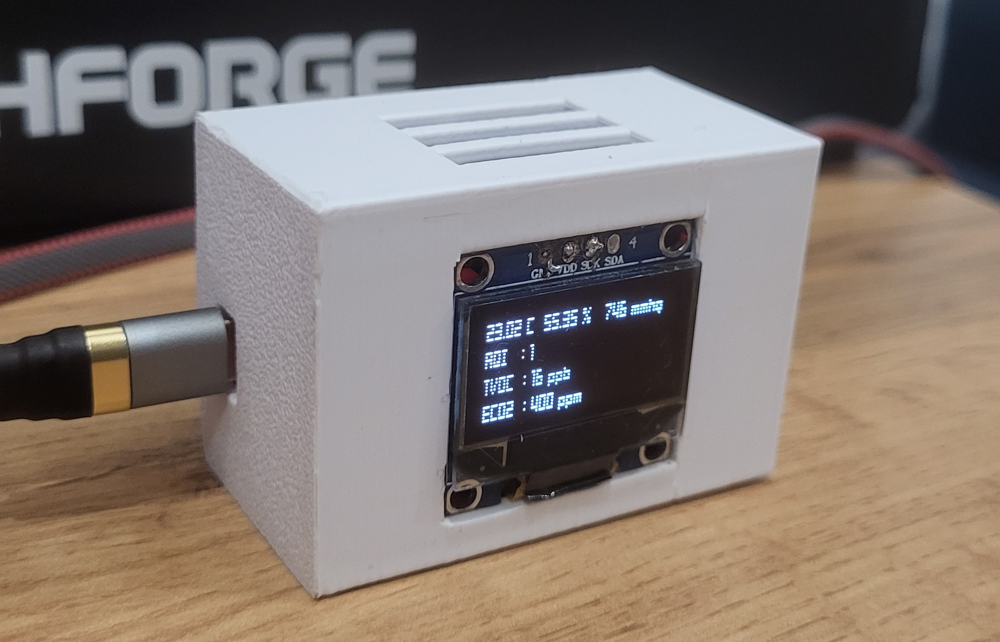

# AIR QUALITY ALARMER
[](https://github.com/EfesX/air-quality-alarmer/actions/workflows/build.yml)




This is a small device that monitors the air quality and informs the people around if the air is not good enough.

The device supports displaying air quality indicators on the display. 

The device supports updating the firmware over Wi-Fi.
To do this, the device tries to connect to the last known Wi-Fi access point, in case of failure, the device raises its own Wi-Fi access point.
In both cases, the device runs an HTTP server that allows you to update the SSID and password of the Wi-Fi or update the firmware.

The device uses buzzer for inform about bad quality air.

## Connections

The device uses the following sensors for measurements: AHT21, BMP280, ENS160.
All sensors and display shares one I2C bus (SCL - PIN_22, SDA - PIN_21). 

Buzzer uses PWM on PIN_32.


## Build and flash

You need to download esp-idf framework, call _export.sh_ or _export.bat_ from the root of the framework's directory and then:

```shell
idf.py build flash
```

